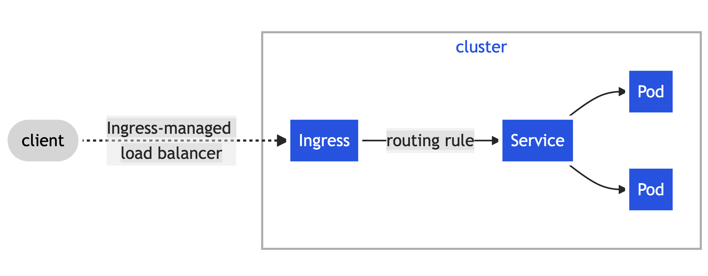
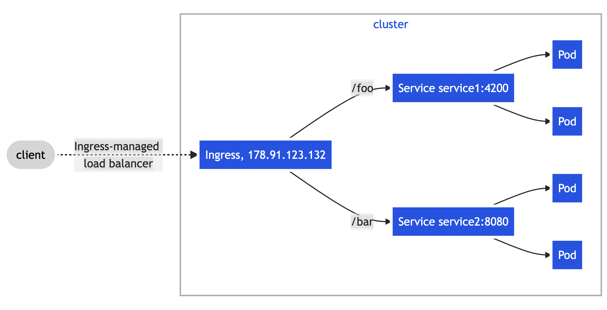
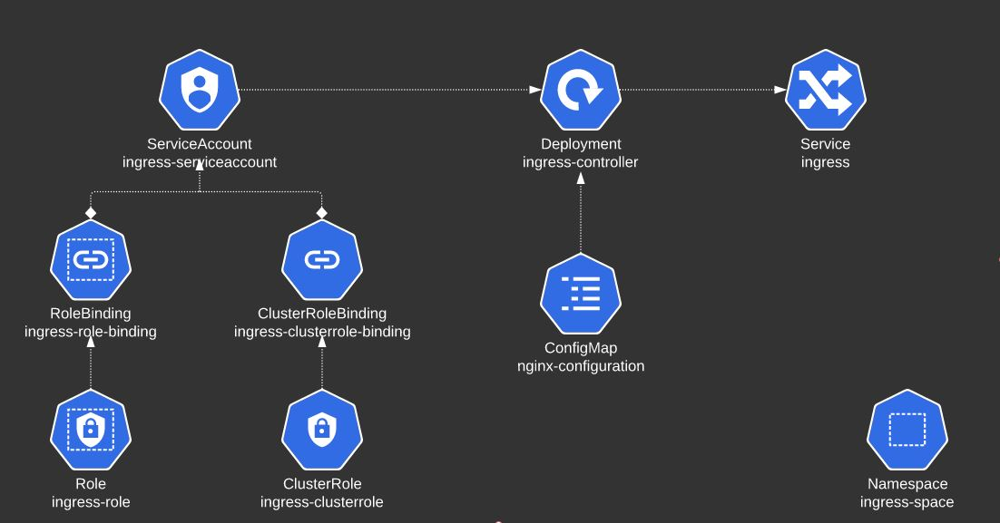

<br/>

# **📓 Kubernetes Notebook**
### 📖 **Author:** **`Ken Yew Piong`**
### 📆 **Last Modified:**  
<a href="https://github.com/KenYew">
  
</a>
<a href="https://gitlab.com/KenYew">
  
</a>

---
# <div id='toc'/> 📋 **Table of Contents** 
1. ### [⚡️ **Quick Notes**](#quicknotes)
0. ### [📓 **Kubernetes Exam Syllabus**](#syllabus)
0. ### [👩‍🔧 **Cluster Maintenance**](#clusterMaintenance)
0. ### [👮🏻‍♀️ **Security**](#security)
0. ### [📚 **Storage**](#storage) 
0. ### [🌍 **Networking**](#networking) 
0. ### [🛠 **Troubleshooting**](#troubleshooting)
0. ### [👩‍💻 **Application Development**](#ckad)

---
# <div id='quicknotes'/> ⚡️ **Quick Notes**
```yaml
# Quickly glance through all available kubectl commands
kubectl --help

# Then, quickly show examples of how to use kubectl commands 
kubectl <command> --help 

# List all the available API resources for this cluster
kubectl api-resources

# Delete Kubernetes objects faster with --force
To delete the pod faster, you can run kubectl delete pod ubuntu-sleeper --force. This can be done for any pod in the lab or the actual exam. It is not recommended to run this in Production, so keep a note of that.

# Remove a static pod manifest from etc/kubernetes/manifests folder to decommission scheduler
mv kube-scheduler.yaml ~ # move a static pod definition file from the static pods manifests folder to HOME

# View logs of a pod with -f for watch and --previous for previous pod
k logs <pod> -n alpha -f --previous

# Inspect kubelet logs for Node failures
ssh node01
journalctl -u kubelet # add the -f flag to run it in watch mode

# Retrieve just the first 2 columns of output and store it in /opt/outputs/pv-and-capacity-sorted.txt.
kubectl get pv -A --sort-by=.spec.capacity.storage -o=custom-columns='NAME:.metadata.name,CAPACITY:.spec.capacity.storage' > /opt/outputs/pv-and-capacity-sorted.txt

NAME       CAPACITY
pv-log-4   40Mi
pv-log-1   100Mi
pv-log-2   200Mi
pv-log-3   300Mi

# Use a JSON PATH query to identify the context configured for the aws-user in the my-kube-config context file and store the result in /opt/outputs/aws-context-name
kubectl config view --kubeconfig=/root/my-kube-config -o jsonpath='{.contexts[?(@.context.user == "aws-user")].name}' > aws-context-name.txt

# Print out OS information of VM
cat /etc/*release*
```
---
# <div id='syllabus'/> 📘 Certified Kubernetes Administrator (CKA) Syllabus
## **25% - ⎈ Cluster Architecture, Installation & Configuration**
- Manage role based access control (RBAC)
- Use Kubeadm to install a basic cluster
- Manage a highly-available Kubernetes cluster
- Provision underlying infrastructure to deploy a Kubernetes cluster
- Perform a version upgrade on a Kubernetes cluster using Kubeadm
- Implement etcd backup and restore

## **15% - ⚡️ Workloads & Scheduling**
- Understand deployments and how to perform rolling update and rollbacks
- Use ConfigMaps and Secrets to configure applications
- Know how to scale applications
- Understand the primitives used to create robust, self-healing, application deployments
- Understand how resource limits can affect Pod scheduling
- Awareness of manifest management and common templating tools

## **20% - 🌍 Services & Networking**
- Understand host networking configuration on the cluster nodes
- Understand ClusterIP, NodePort, LoadBalancer service types and endpoints
- Know how to use Ingress controllers and Ingress resources
- Know how to configure and use CoreDNS
- Choose an appropriate container network interface plugin

## **10% - 📀 Storage**
- Understand storage classes, persistent volumes
- Understand volume mode, access modes and reclaim policies for volumes
- Understand persistent volume claims primitive
- Know how to configure applications with persistent storage

## **30% - 👩‍🔧 Troubleshooting**
- Evaluate cluster and node logging
- Understand how to monitor applications
- Manage container stdout & stderr logs
- Troubleshoot application failure
- Troubleshoot cluster component failure
- Troubleshoot networking
---

# 📕 Certified Kubernetes Application Developer (CKAD) Syllabus
## **20% - 📱 Application Design and Build**
- Define, build and modify container images
- Understand Jobs and CronJobs
- Understand multi-container Pod design patterns (e.g. sidecar, init and others)
- Utilize persistent and ephemeral volumes

## **20% - 📲 Application Deployment**
- Use Kubernetes primitives to implement common deployment strategies (e.g. blue/ green or canary)
- Understand Deployments and how to perform rolling updates
- Use the Helm package manager to deploy existing packages

## **25% - 🌥 Application Environment, Configuration and Security**
- Discover and use resources that extend Kubernetes (CRD)
- Understand authentication, authorization and admission control
- Understanding and defining resource requirements, limits and quotas
- Understand ConfigMaps
- Create & consume Secrets
- Understand ServiceAccounts
- Understand SecurityContexts
## **15% - 🖥 Application Observability and Maintenance**
- Understand API deprecations
- Implement probes and health checks
- Use provided tools to monitor Kubernetes applications
- Utilize container logs
- Debugging in Kubernetes
## **20% - 🌍 Services & Networking**
- Demonstrate basic understanding of NetworkPolicies
- Provide and troubleshoot access to applications via services
- Use Ingress rules to expose applications
---

# <div id='clusterMaintenance'/> 👩‍🔧 Cluster Maintenance
## 🌥 [Kubeadm Cluster Installation](https://kubernetes.io/docs/setup/production-environment/tools/kubeadm/create-cluster-kubeadm/)
> Kubeadm is a tool for quickly installing Kubernetes and setting up a secure cluster. 
>* You can use kubeadm to install both the control plane and the worker node components.

### **Step 1: Install kubelet, kubeadm and kubectl tools on control plane and worker nodes**
```yaml
## Step 1: Install dependencies
# Let iptables see bridged traffic by setting net.bridge.bridge-nf-call-iptables to 1
cat <<EOF | sudo tee /etc/modules-load.d/k8s.conf
br_netfilter
EOF

cat <<EOF | sudo tee /etc/sysctl.d/k8s.conf
net.bridge.bridge-nf-call-ip6tables = 1
net.bridge.bridge-nf-call-iptables = 1
EOF
sudo sysctl --system

# Update the apt package index and install packages needed to use the Kubernetes apt repository
sudo apt-get update
sudo apt-get install -y apt-transport-https ca-certificates curl

# Download the Google Cloud public signing key
sudo curl -fsSLo /usr/share/keyrings/kubernetes-archive-keyring.gpg https://packages.cloud.google.com/apt/doc/apt-key.gpg

# Add the Kubernetes apt repository
echo "deb [signed-by=/usr/share/keyrings/kubernetes-archive-keyring.gpg] https://apt.kubernetes.io/ kubernetes-xenial main" | sudo tee /etc/apt/sources.list.d/kubernetes.list

## Step 2: Install kubelet, kubeadm and kubectl on all nodes (control plane and worker nodes)
sudo apt-get update
sudo apt-get install -y kubelet=1.21.0-00 kubeadm=1.21.0-00 kubectl=1.21.0-00 # remove semantic versions if you want the latest version
sudo apt-mark hold kubelet kubeadm kubectl

## Step 3: Repeat on all worker nodes
ssh <node-of-choice>
# Repeat steps 1 and 2
exit
```

### **Step 2: Initialize control plane by running kubeadm init commands (bootstrapping)**
> Initialize the control plane with `kubeadm init` by using the following options:
>* apiserver-advertise-address - Use the IP address allocated to eth0 on the controlplane node
>* apiserver-cert-extra-sans - Set it to controlplane
>* pod-network-cidr - Set to 10.244.0.0/16. *This will be required for the Pod network add-on later at Step 5.*

```yaml
## Step 1: Check the IP address allocated to eth0 by running:
ifconfig eth0 # Get network interface configuration of device eth0
# Example Output
eth0: flags=4163<UP,BROADCAST,RUNNING,MULTICAST>  mtu 1450
        inet 10.2.223.3  netmask 255.255.255.0  broadcast 10.2.222.255
        ether 02:42:0a:02:de:0a  txqueuelen 0  (Ethernet)
        RX packets 6223  bytes 769785 (769.7 KB)
        RX errors 0  dropped 0  overruns 0  frame 0
        TX packets 5913  bytes 1483419 (1.4 MB)
        TX errors 0  dropped 0 overruns 0  carrier 0  collisions 0

root@controlplane:~#
In this example, the IP address is 10.2.223.3

## Step 2: Run kubeadm init with the required options:
kubeadm init --apiserver-cert-extra-sans=controlplane --apiserver-advertise-address 10.2.223.3 --pod-network-cidr=10.244.0.0/16 # You can select any CIDR range as long as it doesn't overlap with any other host networks
```

### **Step 3: Set up .kubeconfig context in control plane**
```yaml
mkdir -p $HOME/.kube
sudo cp -i /etc/kubernetes/admin.conf $HOME/.kube/config
sudo chown $(id -u):$(id -g) $HOME/.kube/config
```

### **Step 4: Install a CNI based Pod network add-on in control-plane**
#### [**Flannel CNI Installation Example**](https://github.com/flannel-io/flannel#deploying-flannel-manually)
```yaml
# Install a Pod network add-on with the following command on the control-plane node or a node that has the kubeconfig credentials:
kubectl apply -f <add-on.yaml>
kubectl apply -f https://raw.githubusercontent.com/coreos/flannel/master/Documentation/kube-flannel.yml 
# Note: You can install only one Pod network per cluster.
```
### **Step 5: Join the worker node to the cluster with kubeadm join token**
```yaml
## Step 1: Generate a kubeadm join token from the control plane
kubeadm token create --print-join-command
# Example Output
kubeadm join 10.2.223.3:6443 --token 50pj4l.0cy7m2e1jlfmvnif --discovery-token-ca-cert-hash sha256:fb08c01c782ef1d1ad0b643b56c9edd6a864b87cff56e7ff35713cd666659ff4 

## Step 2: SSH to the machine and join the worker node to the cluster with control plane kubeadm token
ssh <node-of-choice>
kubeadm join <control-plane-host>:<control-plane-port> --token <token> --discovery-token-ca-cert-hash sha256:<hash>
# Example Output
root@node01:~# ssh node01
root@node01:~# kubeadm join 10.2.223.3:6443 --token 50pj4l.0cy7m2e1jlfmvnif --discovery-token-ca-cert-hash sha256:fb08c01c782ef1d1ad0b643b56c9edd6a864b87cff56e7ff35713cd666659ff4
[preflight] Running pre-flight checks
        [WARNING IsDockerSystemdCheck]: detected "cgroupfs" as the Docker cgroup driver. The recommended driver is "systemd". Please follow the guide at https://kubernetes.io/docs/setup/cri/
[preflight] Reading configuration from the cluster...
[preflight] FYI: You can look at this config file with 'kubectl -n kube-system get cm kubeadm-config -o yaml'
[kubelet-start] Writing kubelet configuration to file "/var/lib/kubelet/config.yaml"
[kubelet-start] Writing kubelet environment file with flags to file "/var/lib/kubelet/kubeadm-flags.env"
[kubelet-start] Starting the kubelet
[kubelet-start] Waiting for the kubelet to perform the TLS Bootstrap...

This node has joined the cluster:
* Certificate signing request was sent to apiserver and a response was received.
* The Kubelet was informed of the new secure connection details.

Run 'kubectl get nodes' on the control-plane to see this node join the cluster.
```
### **Step 6: Check if control plane and worker nodes are running and ready**
```bash
kubectl get nodes
NAME               STATUS   ROLES                  AGE     VERSION
k8s-controlplane   Ready    control-plane,master   2m35s   v1.21.0
k8s-node-1         Ready    <none>                 2m7s    v1.21.0
k8s-node-2         Ready    <none>                 117s    v1.21.0
```


---
## ⛔️ [Drain and Cordon for Maintenance](https://kubernetes.io/docs/tasks/administer-cluster/safely-drain-node/)
### **Drain all applications from node**
Note: Draining your nodes will also automatically mark it as unschedulable until uncordoned.
```yaml
kubectl drain node01 --ignore-daemonsets
```
### **Mark a node as unschedulable**
This will ensure that no new pods are scheduled on this node and the existing pods will not be affected by this operation.
```yaml
kubectl cordon node01
```
### **Mark a node as schedulable**
```yaml
kubectl uncordon node01
```

---
## 🌟 [Cluster Upgrades](https://kubernetes.io/docs/tasks/administer-cluster/kubeadm/kubeadm-upgrade/) 
### **Step 1: Check current cluster version**
```yaml
kubeadm version
```

### **Step 2: Check and verify next available stable cluster version**
```yaml
kubeadm upgrade plan
# Output: 
Components that must be upgraded manually after you have upgraded the control plane with 'kubeadm upgrade apply':
COMPONENT   CURRENT       AVAILABLE
kubelet     2 x v1.19.0   v1.19.15

Upgrade to the latest version in the v1.19 series:

COMPONENT                 CURRENT   AVAILABLE
kube-apiserver            v1.19.0   v1.19.15
kube-controller-manager   v1.19.0   v1.19.15
kube-scheduler            v1.19.0   v1.19.15
kube-proxy                v1.19.0   v1.19.15
CoreDNS                   1.7.0     1.7.0
etcd                      3.4.9-1   3.4.9-1

You can now apply the upgrade by executing the following command:

        kubeadm upgrade apply v1.19.15

Note: Before you can perform this upgrade, you have to update kubeadm to v1.19.15.
```
### **Step 3: Upgrade Kubeadm, Kubernetes version, Kubectl and Kubelet version**
#### __*Control Plane*__
```bash
# Upgrade kubeadm
sudo apt-mark unhold kubeadm
sudo apt-get update && sudo apt-get install -y kubeadm=1.21.1-00
sudo apt-mark hold kubeadm

# Upgrade controlplane node
kubectl drain k8s-controlplane --ignore-daemonsets
sudo kubeadm upgrade plan
sudo kubeadm upgrade apply v1.21.1

# Update Flannel
kubectl apply -f https://raw.githubusercontent.com/coreos/flannel/master/Documentation/kube-flannel.yml

# Upgrade kubelet and kubectl
sudo apt-mark unhold kubelet kubectl
sudo apt-get update && sudo apt-get install -y kubelet=1.21.1-00 kubectl=1.21.1-00
sudo apt-mark hold kubelet kubectl

sudo systemctl daemon-reload
sudo systemctl restart kubelet

# Make master node reschedulable
kubectl uncordon k8s-controlplane
```
#### __*Worker Node*__
```bash
# SSH into Worker Node
ssh <my-node>

# Upgrade kubeadm
sudo apt-mark unhold kubeadm
sudo apt-get update && sudo apt-get install -y kubeadm=1.21.1-00
sudo apt-mark hold kubeadm

# Upgrade worker node
kubectl drain k8s-node-1 --ignore-daemonsets
sudo kubeadm upgrade node

# Upgrade kubelet and kubectl
sudo apt-mark unhold kubelet kubectl
sudo apt-get update && sudo apt-get install -y kubelet=1.21.1-00 kubectl=1.21.1-00
sudo apt-mark hold kubelet kubectl

sudo systemctl daemon-reload
sudo systemctl restart kubelet

# Make worker node reschedulable
kubectl uncordon k8s-node-1

# Exit or enter CTL + d to go back to the control plane
exit
```

### **Step 4: Verify that the nodes are upgraded to v1.21**

```bash
root@controlplane:~ kubectl get nodes
NAME               STATUS   ROLES                  AGE   VERSION
k8s-controlplane   Ready    control-plane,master   21m   v1.21.1
k8s-node-1         Ready    <none>                 21m   v1.21.1
k8s-node-2         Ready    <none>                 21m   v1.21.1
```

---
## 🧯 [ETCD Backup and Restore](https://kubernetes.io/docs/tasks/administer-cluster/configure-upgrade-etcd/)
### **Step 1: Get ETCD information**
```yaml
kubectl describe pod <ETCD-controlplane-pod>
# Pay close attention to the following commands: 
Command:
      etcd
      --advertise-client-urls=https://10.23.39.3:2379
      --cert-file=/etc/kubernetes/pki/etcd/server.crt # --cert-file
      --client-cert-auth=true
      --data-dir=/var/lib/etcd
      --initial-advertise-peer-urls=https://10.23.39.3:2380
      --initial-cluster=controlplane=https://10.23.39.3:2380
      --key-file=/etc/kubernetes/pki/etcd/server.key # --key-file
      --listen-client-urls=https://127.0.0.1:2379,https://10.23.39.3:2379 # --endpoints
      --listen-metrics-urls=http://127.0.0.1:2381
      --listen-peer-urls=https://10.23.39.3:2380
      --name=controlplane
      --peer-cert-file=/etc/kubernetes/pki/etcd/peer.crt
      --peer-client-cert-auth=true
      --peer-key-file=/etc/kubernetes/pki/etcd/peer.key
      --peer-trusted-ca-file=/etc/kubernetes/pki/etcd/ca.crt
      --snapshot-count=10000
      --trusted-ca-file=/etc/kubernetes/pki/etcd/ca.crt # --cacert
```
### **Step 2: Store a volume snapshot of ETCD using etcdctl options**
```yaml
# You will have to make use of additional flags to connect to the ETCD server.
--endpoints: Optional Flag, points to the address where ETCD is running (127.0.0.1:2379)
--cacert: Mandatory Flag (Absolute Path to the CA certificate file)
--cert: Mandatory Flag (Absolute Path to the Server certificate file)
--key: Mandatory Flag (Absolute Path to the Key file)

# Use the etcdctl snapshot save command. 
Example:
ETCDCTL_API=3 etcdctl --endpoints=https://[127.0.0.1]:2379 \
--cacert=/etc/kubernetes/pki/etcd/ca.crt \
--cert=/etc/kubernetes/pki/etcd/server.crt \
--key=/etc/kubernetes/pki/etcd/server.key \
snapshot save /opt/snapshot-pre-boot.db
```

### **Step 3: Restoring an ETCD cluster**
#### __*Restore the snapshot with a dedicated backup directory (e.g.: /var/lib/etcd-from-backup)*__
```yaml 
root@controlplane:~# ETCDCTL_API=3 etcdctl  --data-dir /var/lib/etcd-from-backup \
snapshot restore /opt/snapshot-pre-boot.db
# Output
2021-03-25 23:52:59.608547 I | mvcc: restore compact to 6466
2021-03-25 23:52:59.621400 I | etcdserver/membership: added member 8e9e05c52164694d [http://localhost:2380] to cluster cdf818194e3a8c32
root@controlplane:~# 
Note: In this case, we are restoring the snapshot to a different directory but in the same server where we took the backup (the controlplane node) As a result, the only required option for the restore command is the --data-dir.
```


#### __*Update the /etc/kubernetes/manifests/etcd.yaml to point the volume hostPath to the new backup directory*__
1. We have now restored the etcd snapshot to a new path on the controlplane `/var/lib/etcd-from-backup`. The only change to be made in the YAML file is to change the hostPath for the volume called etcd-data from old directory `/var/lib/etcd` to the new directory `/var/lib/etcd-from-backup`
2. With this change, `/var/lib/etcd` on the container points to `/var/lib/etcd-from-backup` on the controlplane (which is what we want)
3. When this file is updated, the ETCD pod is automatically re-created as this is a static pod placed under the `/etc/kubernetes/manifests` directory.
```  yaml
kubectl edit po etcd-controlplane -n kubesystem
volumes:
- hostPath:
    path: /var/lib/etcd-from-backup
    type: DirectoryOrCreate
  name: etcd-data
```
4. As the ETCD pod has changed it will automatically restart, and also kube-controller-manager and kube-scheduler. Wait 1-2 to mins for this pods to restart. You can run a watch "docker ps | grep etcd" command to see when the ETCD pod is restarted.
5. If the etcd pod is not getting Ready 1/1, then restart it by kubectl delete pod -n kube-system etcd-controlplane and wait 1 minute.
6. This is the simplest way to make sure that ETCD uses the restored data after the ETCD pod is recreated. You don't have to change anything else.
- [x] Optional: If you do change --data-dir to /var/lib/etcd-from-backup in the YAML file, make sure that the volumeMounts for etcd-data is updated as well, with the mountPath pointing to /var/lib/etcd-from-backup

---

## ⚡️ [Configure Multiple Schedulers](https://kubernetes.io/docs/tasks/extend-kubernetes/configure-multiple-schedulers/)
> Kubernetes ships with a default scheduler which is a control plane component that watches for newly created Pods with no assigned node, and selects a node for them to run on. 
>* If the default scheduler does not suit your needs, you can implement your own scheduler. 
>* Moreover, you can even run multiple schedulers simultaneously alongside the default scheduler and instruct Kubernetes what scheduler to use for each of your pods. 
```yaml
# Step 1: Copy kube-scheduler.yaml from the directory /etc/kubernetes/manifests/ to any other location and then change the name to my-scheduler.
cp /etc/kubernetes/manifests/kube-scheduler.yaml my-scheduler.yaml

# Step 2: Add or update the following command arguments in the YAML file:
- --leader-elect=false
- --port=10282
- --scheduler-name=my-scheduler
- --secure-port=0
```
- [x] Here, we are setting leader-elect to false for our new custom scheduler called my-scheduler.
- [x] We are also making use of a different port 10282 which is not currently in use in the controlplane.
- [x] The default scheduler uses secure-port on port 10259 to serve HTTPS with authentication and authorization. This is not needed for our custom scheduler, so we can disable HTTPS by setting the value of secure-port to 0.
- [x] Finally, because we have set secure-port to 0, replace HTTPS with HTTP and use the correct ports under liveness and startup probes.

```yaml
# Step 3: With the Pod definition file created and updated, run the following command using the below manifest:
kubectl apply -f my-scheduler.yaml
---
apiVersion: v1
kind: Pod
metadata:
  labels:
    component: my-scheduler
    tier: control-plane
  name: my-scheduler
  namespace: kube-system
spec:
  containers:
  - command:
    - kube-scheduler
    - --authentication-kubeconfig=/etc/kubernetes/scheduler.conf
    - --authorization-kubeconfig=/etc/kubernetes/scheduler.conf
    - --bind-address=127.0.0.1
    - --kubeconfig=/etc/kubernetes/scheduler.conf
    - --leader-elect=false # To be updated
    - --port=10282 # To be updated
    - --scheduler-name=my-scheduler # To be updated
    - --secure-port=0 # To be updated
    image: k8s.gcr.io/kube-scheduler:v1.19.0
    imagePullPolicy: IfNotPresent
    livenessProbe:
      failureThreshold: 8
      httpGet:
        host: 127.0.0.1
        path: /healthz
        port: 10282 # To be updated
        scheme: HTTP
      initialDelaySeconds: 10
      periodSeconds: 10
      timeoutSeconds: 15
    name: kube-scheduler
    resources:
      requests:
        cpu: 100m
    startupProbe:
      failureThreshold: 24
      httpGet:
        host: 127.0.0.1
        path: /healthz
        port: 10282 # To be updated
        scheme: HTTP
      initialDelaySeconds: 10
      periodSeconds: 10
      timeoutSeconds: 15
    volumeMounts:
    - mountPath: /etc/kubernetes/scheduler.conf
      name: kubeconfig
      readOnly: true
  hostNetwork: true
  priorityClassName: system-node-critical
  volumes:
  - hostPath:
      path: /etc/kubernetes/scheduler.conf
      type: FileOrCreate
    name: kubeconfig
status: {}

# Step 4: Use the schedulerName property to use the custom scheduler for the pod
---
apiVersion: v1 
kind: Pod 
metadata:
  name: nginx 
spec:
  schedulerName: my-scheduler # Set to the custom scheduler name
  containers:
  - image: nginx
    name: nginx
Run kubectl create -f nginx-pod.yaml
```
---
# <div id='security'/> 👮🏻‍♀️ Security
## 🔏 [Certificates](https://kubernetes.io/docs/reference/access-authn-authz/certificate-signing-requests/)
> A cryptographically secure file used to validate access to the Kubernetes cluster.
>* Certificates enable applications within a Kubernetes cluster to access the Kubernetes API securely. 
>* Certificates validate that clients are allowed to access the API.

### **View Certificate Details**
```yaml
# Go to manifest files that deploy controlplane components as static pods
ls -la /etc/kubernetes/manifests

# View apiServer component details for certificate commands
e.g. cat /etc/kubernetes/manifests/kube-apiserver.yaml | grep cert

# View certificate details for apiServer TLS certificate
openssl x509 -in /etc/kubernetes/pki/apiserver.crt -text
```

```yaml
If we inspect the kube-apiserver container on the controlplane, we can see that it is frequently exiting.

root@controlplane:~# docker ps -a | grep kube-apiserver
8af74bd23540        ca9843d3b545           "kube-apiserver --ad…"   39 seconds ago      Exited (1) 17 seconds ago                          k8s_kube-apiserver_kube-apiserver-controlplane_kube-system_f320fbaff7813586592d245912262076_4
c9dc4df82f9d        k8s.gcr.io/pause:3.2   "/pause"                 3 minutes ago       Up 3 minutes                                       k8s_POD_kube-apiserve-controlplane_kube-system_f320fbaff7813586592d245912262076_1
root@controlplane:~# 
If we now inspect the logs of this exited container, we would see the following errors:

root@controlplane:~# docker logs 8af74bd23540  --tail=2
W0520 01:57:23.333002       1 clientconn.go:1223] grpc: addrConn.createTransport failed to connect to {https://127.0.0.1:2379  <nil> 0 <nil>}. Err :connection error: desc = "transport: authentication handshake failed: x509: certificate signed by unknown authority". Reconnecting...
Error: context deadline exceeded
root@controlplane:~# 
This indicates an issue with the ETCD CA certificate used by the kube-apiserver. Correct it to use the file /etc/kubernetes/pki/etcd/ca.crt.

Once the YAML file has been saved, wait for the kube-apiserver pod to be Ready. This can take a couple of minutes.
```
---
## 🔏 [Certificates API](https://kubernetes.io/docs/reference/access-authn-authz/certificate-signing-requests/)
> A CertificateSigningRequest (CSR) resource is used to request that a certificate be signed by a denoted signer, after which the request may be approved or denied before finally being signed.


### **Create CertificateSigningRequest**
Create a CertificateSigningRequest and submit it to a Kubernetes Cluster via kubectl. Below is a script to generate the CertificateSigningRequest.
```yaml
cat <<EOF | kubectl apply -f -
apiVersion: certificates.k8s.io/v1
kind: CertificateSigningRequest
metadata:
  name: myuser
spec:
  request: LS0tLS1CRUdJTiBDRVJUSUZJQ0FURSBSRVFVRVNULS0tLS0KTUlJQ1ZqQ0NBVDRDQVFBd0VURVBNQTBHQTFVRUF3d0dZVzVuWld4aE1JSUJJakFOQmdrcWhraUc5dzBCQVFFRgpBQU9DQVE4QU1JSUJDZ0tDQVFFQTByczhJTHRHdTYxakx2dHhWTTJSVlRWMDNHWlJTWWw0dWluVWo4RElaWjBOCnR2MUZtRVFSd3VoaUZsOFEzcWl0Qm0wMUFSMkNJVXBGd2ZzSjZ4MXF3ckJzVkhZbGlBNVhwRVpZM3ExcGswSDQKM3Z3aGJlK1o2MVNrVHF5SVBYUUwrTWM5T1Nsbm0xb0R2N0NtSkZNMUlMRVI3QTVGZnZKOEdFRjJ6dHBoaUlFMwpub1dtdHNZb3JuT2wzc2lHQ2ZGZzR4Zmd4eW8ybmlneFNVekl1bXNnVm9PM2ttT0x1RVF6cXpkakJ3TFJXbWlECklmMXBMWnoyalVnald4UkhCM1gyWnVVV1d1T09PZnpXM01LaE8ybHEvZi9DdS8wYk83c0x0MCt3U2ZMSU91TFcKcW90blZtRmxMMytqTy82WDNDKzBERHk5aUtwbXJjVDBnWGZLemE1dHJRSURBUUFCb0FBd0RRWUpLb1pJaHZjTgpBUUVMQlFBRGdnRUJBR05WdmVIOGR4ZzNvK21VeVRkbmFjVmQ1N24zSkExdnZEU1JWREkyQTZ1eXN3ZFp1L1BVCkkwZXpZWFV0RVNnSk1IRmQycVVNMjNuNVJsSXJ3R0xuUXFISUh5VStWWHhsdnZsRnpNOVpEWllSTmU3QlJvYXgKQVlEdUI5STZXT3FYbkFvczFqRmxNUG5NbFpqdU5kSGxpT1BjTU1oNndLaTZzZFhpVStHYTJ2RUVLY01jSVUyRgpvU2djUWdMYTk0aEpacGk3ZnNMdm1OQUxoT045UHdNMGM1dVJVejV4T0dGMUtCbWRSeEgvbUNOS2JKYjFRQm1HCkkwYitEUEdaTktXTU0xMzhIQXdoV0tkNjVoVHdYOWl4V3ZHMkh4TG1WQzg0L1BHT0tWQW9FNkpsYWFHdTlQVmkKdjlOSjVaZlZrcXdCd0hKbzZXdk9xVlA3SVFjZmg3d0drWm89Ci0tLS0tRU5EIENFUlRJRklDQVRFIFJFUVVFU1QtLS0tLQo=
  signerName: kubernetes.io/kube-apiserver-client
  expirationSeconds: 86400  # one day
  usages:
  - client auth
EOF
```
Some points to note:

* usages has to be 'client auth'
* expirationSeconds could be made longer (i.e. 864000 for ten days) or shorter (i.e. 3600 for one hour)
* request is the base64 encoded value of the CSR file content. You can get the content using this command: cat myuser.csr | base64 | tr -d "\n"

### **CSR Kubectl Commands**
```yaml
# List all CSRs in default namespace
kubectl get csr
# Approve CSR request
kubectl certificate approve myuser
# Reject CSR request
kubectl certificate deny myuser
```
---
## 📝 [KubeConfig](https://kubernetes.io/docs/tasks/access-application-cluster/configure-access-multiple-clusters/)
### **Kubectl context and configuration**
> Set which Kubernetes cluster kubectl communicates with and modifies configuration information.
```yaml
kubectl config view # Show Merged kubeconfig settings.

# use multiple kubeconfig files at the same time and view merged config
KUBECONFIG=~/.kube/config:~/.kube/kubconfig2 

kubectl config view

# get the password for the e2e user
kubectl config view -o jsonpath='{.users[?(@.name == "e2e")].user.password}'

kubectl config view -o jsonpath='{.users[].name}'    # display the first user
kubectl config view -o jsonpath='{.users[*].name}'   # get a list of users
kubectl config get-contexts                          # display list of contexts 
kubectl config current-context                       # display the current-context
kubectl config use-context my-cluster-name           # set the default context to my-cluster-name

# add a new user to your kubeconf that supports basic auth
kubectl config set-credentials kubeuser/foo.kubernetes.com --username=kubeuser --password=kubepassword

# permanently save the namespace for all subsequent kubectl commands in that context.
kubectl config set-context --current --namespace=ggckad-s2

# set a context utilizing a specific username and namespace.
kubectl config set-context gce --user=cluster-admin --namespace=foo \
  && kubectl config use-context gce

kubectl config unset users.foo                       # delete user foo
```

### **Use context from another kubeconfig file**
```yaml
# To use that context, run the command: 
kubectl config --kubeconfig=/root/my-kube-config use-context research
# To know the current context, run the command: 
kubectl config --kubeconfig=/root/my-kube-config current-context
```
---
## 🔐 [Role-Based Access Control](https://kubernetes.io/docs/reference/access-authn-authz/rbac/#rolebinding-and-clusterrolebinding)
> Role-based access control (RBAC) is a method of regulating access to computer or network resources based on the roles of individual users within your organization. 
> * Manages authorization decisions, allowing admins to dynamically configure access policies through the Kubernetes API.
> * RBAC utilizes roles, which contain permission rules, and role bindings, which grant the permissions defined in a role to a set of users.

### **List and inspect RBAC roles**
```yaml
# List all RBAC roles in default namespace
kubectl get roles
# Determine which principal is binded to the kube-proxy RBAC role
kubectl describe rolebinding kube-proxy -n kube-system
# Check if dev-user is permitted to get pods
kubectl auth can-i get pods --as dev-user
kubectl get pods --as dev-user
# Check list of all role bindings (with users and roles)
kubectl get rolebindings -A -o wide
```
---
## 🧑‍💻 [Roles](https://kubernetes.io/docs/reference/access-authn-authz/rbac/#role-and-clusterrole)
> A Role always sets permissions within a particular namespace; when you create a Role, you have to specify the namespace it belongs in.
### **Create and bind roles**
```yaml
# Create role
kubectl create role developer --verb=list,create --resource=pods --namespace=default
# Bind role to user
kubectl create rolebinding dev-user-binding --role=developer --user=dev-user --namespace=default
# Check if role binding worked
kubectl auth can-i list pods --as dev-user

# Alternative Delarative Method
kind: Role
apiVersion: rbac.authorization.k8s.io/v1
metadata:
  namespace: default
  name: developer
rules:
- apiGroups: [""]
  resources: ["pods"] # use kubectl api-resources to get a full list of resources
  verbs: ["list", "create"]

---
kind: RoleBinding
apiVersion: rbac.authorization.k8s.io/v1
metadata:
  name: dev-user-binding
subjects:
- kind: User
  name: dev-user
  apiGroup: rbac.authorization.k8s.io
roleRef:
  kind: Role
  name: developer
  apiGroup: rbac.authorization.k8s.io

# Example Role and RoleBinding manifest 
# RBAC role to create deployments
---
kind: Role
apiVersion: rbac.authorization.k8s.io/v1
metadata:
  namespace: blue
  name: deploy-role
rules:
- apiGroups: ["apps", "extensions"]
  resources: ["deployments"]
  verbs: ["create"]

---
kind: RoleBinding
apiVersion: rbac.authorization.k8s.io/v1
metadata:
  name: dev-user-deploy-binding
  namespace: blue
subjects:
- kind: User
  name: dev-user
  apiGroup: rbac.authorization.k8s.io
roleRef:
  kind: Role
  name: deploy-role
  apiGroup: rbac.authorization.k8s.io
```


---
## ⛅ [Cluster Roles](https://kubernetes.io/docs/reference/access-authn-authz/rbac/#role-and-clusterrole)
> ClusterRole, by contrast, is a non-namespaced resource. The resources have different names (Role and ClusterRole) because a Kubernetes object always has to be either namespaced or not namespaced; it can't be both.
> ClusterRoles have several uses. You can use a ClusterRole to:
>* define permissions on namespaced resources and be granted within individual namespace(s)
>* define permissions on namespaced resources and be granted across all namespaces
>* define permissions on cluster-scoped resources

### **Create and bind cluster roles**
```yaml
# Create cluster role
kubectl create clusterrole node-reader --verb=get,list,watch --resource=nodes
# Bind cluster role to user
kubectl create clusterrolebinding michelle-binding --clusterrole=node-reader --user=michelle
# Check if cluster role binding worked
kubectl auth can-i list nodes --as michelle

# Alternative Delarative Method
---
kind: ClusterRole
apiVersion: rbac.authorization.k8s.io/v1
metadata:
  name: node-admin
rules:
- apiGroups: [""]
  resources: ["nodes"] # use kubectl api-resources to get a full list of resources
  verbs: ["get", "watch", "list", "create", "delete"]

---
kind: ClusterRoleBinding
apiVersion: rbac.authorization.k8s.io/v1
metadata:
  name: michelle-binding
subjects:
- kind: User
  name: michelle
  apiGroup: rbac.authorization.k8s.io
roleRef:
  kind: ClusterRole
  name: node-admin
  apiGroup: rbac.authorization.k8s.io

# Example ClusterRole and ClusterRoleBinding manifest 
# RBAC cluster role for full admin access to persistent volumes and storage classes
---
kind: ClusterRole
apiVersion: rbac.authorization.k8s.io/v1
metadata:
  name: storage-admin
rules:
- apiGroups: [""]
  resources: ["persistentvolumes"]
  verbs: ["get", "watch", "list", "create", "delete"]
- apiGroups: ["storage.k8s.io"]
  resources: ["storageclasses"]
  verbs: ["get", "watch", "list", "create", "delete"]

---
kind: ClusterRoleBinding
apiVersion: rbac.authorization.k8s.io/v1
metadata:
  name: michelle-storage-admin
subjects:
- kind: User
  name: michelle
  apiGroup: rbac.authorization.k8s.io
roleRef:
  kind: ClusterRole
  name: storage-admin
  apiGroup: rbac.authorization.k8s.io
```
---
## 👩‍🔧 [Service Account](https://kubernetes.io/docs/tasks/configure-pod-container/configure-service-account/)
> Provides an identity for processes that run in a Pod. When processes inside Pods access the cluster, they are authenticated by the API server as a particular service account, for example, default. 

### **Service Account Commands**
```yaml
# Get service accounts
kubectl get serviceaccounts

# Create and apply service account
kubectl apply -f - <<EOF
apiVersion: v1
kind: ServiceAccount
metadata:
  creationTimestamp: 2015-06-16T00:12:59Z
  name: build-robot
  namespace: default
  resourceVersion: "272500"
  uid: 721ab723-13bc-11e5-aec2-42010af0021e
secrets:
- name: build-robot-token-bvbk5
EOF
```

---

## 📀 [Image Security](https://kubernetes.io/docs/tasks/configure-pod-container/pull-image-private-registry/)
> A container image represents binary data that encapsulates an application and all its software dependencies. Container images are executable software bundles that can run standalone and that make very well defined assumptions about their runtime environment.
>* You typically create a container image of your application and push it to a registry before referring to it in a Pod
### **Pull an image from a private registry**
```yaml
# Use the kubectl edit deployment command to edit the image name to myprivateregistry.com:5000/nginx:alpine.
spec:
  containers:
  - image: myprivateregistry.com:5000/nginx:alpine
    imagePullPolicy: IfNotPresent
    name: nginx        
  imagePullSecrets: # See below for the secret to be created as a pre-requisite
  - name: private-reg-cred
```
### **Create a Docker Secret imperatively**
```yaml
kubectl create secret docker-registry regcred --docker-server=<your-registry-server> --docker-username=<your-name> --docker-password=<your-pword> --docker-email=<your-email>
# where:
# <your-registry-server> is your Private Docker Registry FQDN. Use https://index.docker.io/v1/ for DockerHub.
# <your-name> is your Docker username.
# <your-pword> is your Docker password.
# <your-email> is your Docker email.
Example run: kubectl create secret docker-registry private-reg-cred --docker-username=dock_user --docker-password=dock_password --docker-server=myprivateregistry.com:5000 --docker-email=dock_user@myprivateregistry.com
```

---
## 👮🏻‍♀️ [Security Contexts](https://kubernetes.io/docs/tasks/configure-pod-container/security-context/)
> A security context defines privilege and access control settings for a Pod or Container.
>* In a securityContext, you can define: the user that processes run as, the group that processes run as, and privilege settings. You can also configure security policies (for example: SELinux, AppArmor or seccomp).
### **Security Contexts - Commands and Definitions**
```yaml
# Check the user that is running the container.
kubectl exec ubuntu-sleeper -- whoami 

# Set the security context to pods and containers
apiVersion: v1
kind: Pod
metadata:
  name: multi-pod
spec:
  securityContext:
    runAsUser: 1001 # Pod level security context but superceded if specified container level
  containers:
  -  image: ubuntu
     name: web
     command: ["sleep", "5000"]
     securityContext:
      runAsUser: 1002 # Container level security context

  -  image: ubuntu
     name: sidecar
     command: ["sleep", "5000"]
# Hence, web will run as user 1002 while sidecar will run as user 1001

# Set the security context as root user with extra capabiltiies to containers
---
apiVersion: v1
kind: Pod
metadata:
  name: ubuntu-sleeper
  namespace: default
spec:
  containers:
  - command:
    - sleep
    - "4800"
    image: ubuntu
    name: ubuntu-sleeper
    securityContext:
      capabilities:
        add: ["NET_ADMIN", "SYS_TIME"] # Adds root user with NET_ADMIN and SYS_TIME capabilities. Note: Can only be done in the container level!
```
---
## 🔒 [Network Policies](https://kubernetes.io/docs/home/)
A specification of how groups of Pods are allowed to communicate with each other and with other network endpoints.
>* Network Policies help you declaratively configure which Pods are allowed to connect to each other, which namespaces are allowed to communicate, and more specifically which port numbers to enforce each policy on. 
>* NetworkPolicy resources use labels to select Pods and define rules which specify what traffic is allowed to the selected Pods.

### **Network Policies Commands**
```yaml
# Get network policies
kubectl get netpol
# Describe network policies for policyTypes and podSelector
kubectl describe netpol mynetpol
```

### **Ingress and Egress Traffic**
```yaml
## INGRESS TRAFFIC
# Default deny all ingress traffic
apiVersion: networking.k8s.io/v1
kind: NetworkPolicy
metadata:
  name: default-deny-ingress
spec:
  podSelector: {}
  policyTypes:
  - Ingress

# Default allow all ingress traffic
apiVersion: networking.k8s.io/v1
kind: NetworkPolicy
metadata:
  name: allow-all-ingress
spec:
  podSelector: {}
  ingress:
  - {}
  policyTypes:
  - Ingress

## EGRESS TRAFFIC
# Default deny all egress traffic
apiVersion: networking.k8s.io/v1
kind: NetworkPolicy
metadata:
  name: default-deny-egress
spec:
  podSelector: {}
  policyTypes:
  - Egress

# Default allow all egress traffic
apiVersion: networking.k8s.io/v1
kind: NetworkPolicy
metadata:
  name: allow-all-egress
spec:
  podSelector: {}
  egress:
  - {}
  policyTypes:
  - Egress

# ALL TRAFFIC
# Default deny all ingress and all egress traffic
apiVersion: networking.k8s.io/v1
kind: NetworkPolicy
metadata:
  name: default-deny-all
spec:
  podSelector: {}
  policyTypes:
  - Ingress
  - Egress
```

### **Network Policy Internal-Policy Example**


```yaml
# Create a network policy to allow traffic from the Internal application only to the payroll-service and db-service.
Policy Name: internal-policy
Policy Type: Egress
Egress Allow: payroll
Payroll Port: 8080
Egress Allow: mysql
MySQL Port: 3306

# Solution manifest file for a network policy internal-policy as follows:
apiVersion: networking.k8s.io/v1
kind: NetworkPolicy
metadata:
  name: internal-policy
  namespace: default
spec:
  podSelector:
    matchLabels:
      name: internal # internal pod's network policy
  policyTypes:
  - Egress
  - Ingress
  ingress:
    - {} # allow all ingress traffic
  egress: 
  - to: # allow only specific egress traffic to certain pods and ports
    - podSelector:
        matchLabels:
          name: mysql
    ports:
    - protocol: TCP
      port: 3306

  - to:
    - podSelector:
        matchLabels:
          name: payroll
    ports:
    - protocol: TCP
      port: 8080

  - ports: # allow all egress traffic to ports 53 (UDP/TCP) for kube-dns service
    - port: 53
      protocol: UDP
    - port: 53
      protocol: TCP

Note: We have also allowed Egress traffic to TCP and UDP port. This has been added to ensure that the internal DNS resolution works from the internal pod. Remember: The kube-dns service is exposed on port 53:

root@controlplane:~# kubectl get svc -n kube-system 
NAME       TYPE        CLUSTER-IP   EXTERNAL-IP   PORT(S)                  AGE
kube-dns   ClusterIP   10.96.0.10   <none>        53/UDP,53/TCP,9153/TCP   93m
```
---
# <div id='storage'/> 📚 Storage
## 💽 [Persistent Volume Claims](https://kubernetes.io/docs/concepts/storage/persistent-volumes/)
> **Persistent Volumes**
>* An API object that represents a piece of storage in the cluster. Available as a general, pluggable resource that persists beyond the lifecycle of any individual Pod.
>* PersistentVolumes (PVs) provide an API that abstracts details of how storage is provided from how it is consumed. PVs are used directly in scenarios where storage can be created ahead of time (static provisioning). 

> **Persistent Volume Claim**
>* Claims storage resources defined in a PersistentVolume so that it can be mounted as a volume in a container.
>* Specifies the amount of storage, how the storage will be accessed (read-only, read-write and/or exclusive) and how it is reclaimed (retained, recycled or deleted).

> Persistent Volumes can have various reclaim policies, including **"Retain", "Recycle", and "Delete".**
>* For dynamically provisioned PersistentVolumes, the default reclaim policy is "Delete". This means that a dynamically provisioned volume is automatically deleted when a user deletes the corresponding PersistentVolumeClaim. This automatic behavior might be inappropriate if the volume contains precious data. 
>* In that case, it is more appropriate to use the "Retain" policy. With the "Retain" policy, if a user deletes a PersistentVolumeClaim, the corresponding PersistentVolume will not be deleted. Instead, it is moved to the Released phase, where all of its data can be manually recovered.
>* __*Note: PersistentVolume in Retain mode will not be released until PVC and the associated pods are deleted first!*__


### **Persistent Volume - Commands and Definitions**
```yaml
# Execute pod command to view logs in local storage
kubectl exec webapp -- cat /log/app.log

# Creating a persistent volume 
apiVersion: v1
kind: PersistentVolume
metadata:
  name: pv-log
spec:
  persistentVolumeReclaimPolicy: Retain
  accessModes:
    - ReadWriteMany
  capacity:
    storage: 100Mi
  hostPath:
    path: /pv/log

# Creating a persistent volume claim
kind: PersistentVolumeClaim
apiVersion: v1
metadata:
  name: claim-log-1
spec:
  accessModes:
    - ReadWriteMany # ACCESS MODES IN PVC MUST MATCH WITH THAT OF PV TO CLAIM
  resources:
    requests:
      storage: 50Mi

# Mounting PV and PVC to pod
apiVersion: v1
kind: Pod
metadata:
  name: webapp
spec:
  containers:
  - name: event-simulator
    image: kodekloud/event-simulator
    env:
    - name: LOG_HANDLERS
      value: file
    volumeMounts: # mount persistent volume to pod
    - mountPath: /log
      name: log-volume

  volumes: # referencing from persistent volume claim
  - name: log-volume
    persistentVolumeClaim:
      claimName: claim-log-1
    ## Use Host Path to reference external volumes
    # hostPath:
    #   # directory location on host
    #   path: /var/log/webapp
    #   # this field is optional
    #   type: Directory
```
---
## 💿 [Storage Classes](https://kubernetes.io/docs/concepts/storage/storage-classes/)
> A StorageClass provides a way for administrators to describe different available storage types. 
>* StorageClasses can map to quality-of-service levels, backup policies, or to arbitrary policies determined by cluster administrators. 
>* Each StorageClass contains the fields provisioner, parameters, and reclaimPolicy, which are used when a Persistent Volume belonging to the class needs to be dynamically provisioned. 
>* Users can request a particular class using the name of a StorageClass object.

#### **Volume Binding Modes**
> The volumeBindingMode field controls when volume binding and dynamic provisioning should occur. When unset, "Immediate" mode is used by default.
>* The Immediate mode indicates that volume binding and dynamic provisioning occurs once the PersistentVolumeClaim is created. For storage backends that are topology-constrained and not globally accessible from all Nodes in the cluster, PersistentVolumes will be bound or provisioned without knowledge of the Pod's scheduling requirements. This may result in unschedulable Pods.
>* A cluster administrator can address this issue by specifying the **WaitForFirstConsumer mode which will delay the binding and provisioning of a PersistentVolume until a Pod using the PersistentVolumeClaim is created**. PersistentVolumes will be selected or provisioned conforming to the topology that is specified by the Pod's scheduling constraints.
### **Storage Class - Commands and Definitions**
```yaml
# Local Storage Class
apiVersion: storage.k8s.io/v1
kind: StorageClass
metadata:
  name: local-storage
provisioner: kubernetes.io/no-provisioner # local storage class do not currently support dynamic provisioning
volumeBindingMode: WaitForFirstConsumer

# Persistent Volume Claim with Local Storage Class
kind: PersistentVolumeClaim
apiVersion: v1
metadata:
  name: local-pvc 
spec:
  accessModes:
  - ReadWriteOnce # ACCESS MODES IN PVC MUST MATCH WITH THAT OF PV TO CLAIM
  storageClassName: local-storage
  resources:
    requests:
      storage: 500Mi

# Mounting PV and PVC to pod
apiVersion: v1
kind: Pod
metadata:
  name: nginx
  labels:
    name: nginx
spec:
  containers:
  - name: nginx
    image: nginx:alpine
    volumeMounts:
      - name: local-persistent-storage
        mountPath: /var/www/html
  volumes:
    - name: local-persistent-storage
      persistentVolumeClaim:
        claimName: local-pvc
```
---
# <div id='networking'/> 🌍 Networking
## 🌍 [Exploring the Kubernetes Network Environment](https://access.redhat.com/sites/default/files/attachments/rh_ip_command_cheatsheet_1214_jcs_print.pdf)
### **Determine network interface information of Control Plane**
`Command: ip addr - displays information for all addresses and property information`
```yaml
# Step 1: Determine the node's internal IP address using: 
kubectl describe node my-node

# Step 2: Use the `ip addr` command line with `grep -B2` on the internal IP address
ip addr | grep -B2 10.43.194.6 # Displays information of all IP addresses and filter with -B2 flag
ip addr show dev eth0 # Display information only for device eth0

# Example output:
root@controlplane:~# ip a | grep -B2 10.43.194.6
15676: eth0@if15677: <BROADCAST,MULTICAST,UP,LOWER_UP> mtu 1450 qdisc noqueue state UP group default 
    link/ether 02:42:0a:2b:c2:06 brd ff:ff:ff:ff:ff:ff link-netnsid 0
    inet 10.43.194.6/24 brd 10.43.194.255 scope global eth0
# Hence, eth0 is the control plane's network interface for cluster connectivity 
```
### **Determine network interface information of Worker Nodes**
`Command: arp <node> - send ARP request to <node>`
```yaml
## Use the Address Resolution Protocol (ARP) which resolves IPs (Layer 3) to MAC addresses (Layer 2)
arp node01

# Example Output:
root@controlplane:~# arp node01
Address                  HWtype  HWaddress           Flags Mask            Iface
10.43.194.8              ether   02:42:0a:2b:c2:07   C  
```

### **Determine network interface information of Docker Containers**
`Command: ip link - displays information for all interfaces with their states`
```yaml
## Use the `ip link` command and look for a bridge interface created by docker.
ip link # Shows information of all interfaces. This displays the state of all network interfaces.
ip link show dev docker0 # Display information only for device docker0

# Example Output: 
2: docker0: <NO-CARRIER,BROADCAST,MULTICAST,UP> mtu 1500 qdisc noqueue state DOWN mode DEFAULT group default 
    link/ether 02:42:c3:b1:12:19 brd ff:ff:ff:ff:ff:ff
```

### **Determine the IP address of the Default Gateway**
`Command: ip route - displays the route the IP address will take`
```yaml
ip route show default # Show the route the IP address will take to the Default Gateway
# Example Output: 
root@controlplane:~# ip route show default
default via 172.17.0.1 dev eth1 # The route to the Default Gateway will be via the eth1 device using IP: 172.17.0.1
```

### **Determine the listening port of kube-scheduler and ETCD**
`Command: netstat - displays statistics of network connections for TCP, routing tables, network interfaces and network protocol`
```yaml
root@controlplane: netstat -nplt # Show network statistics of servers only
Active Internet connections (only servers)
Proto Recv-Q Send-Q Local Address           Foreign Address         State       PID/Program name    
tcp        0      0 127.0.0.1:10248         0.0.0.0:*               LISTEN      4796/kubelet        
tcp        0      0 127.0.0.1:10249         0.0.0.0:*               LISTEN      5915/kube-proxy     
tcp        0      0 127.0.0.1:2379          0.0.0.0:*               LISTEN      3586/etcd           
tcp        0      0 10.43.194.6:2379        0.0.0.0:*               LISTEN      3586/etcd           
tcp        0      0 10.43.194.6:2380        0.0.0.0:*               LISTEN      3586/etcd           
tcp        0      0 127.0.0.1:2381          0.0.0.0:*               LISTEN      3586/etcd           
tcp        0      0 0.0.0.0:8080            0.0.0.0:*               LISTEN      770/ttyd            
tcp        0      0 127.0.0.1:10257         0.0.0.0:*               LISTEN      4038/kube-controlle 
tcp        0      0 127.0.0.11:36241        0.0.0.0:*               LISTEN      -                   
tcp        0      0 127.0.0.1:10259         0.0.0.0:*               LISTEN      3920/kube-scheduler 
tcp        0      0 127.0.0.53:53           0.0.0.0:*               LISTEN      464/systemd-resolve 
tcp        0      0 0.0.0.0:22              0.0.0.0:*               LISTEN      777/sshd            
tcp        0      0 127.0.0.1:38141         0.0.0.0:*               LISTEN      4796/kubelet        
tcp6       0      0 :::10250                :::*                    LISTEN      4796/kubelet        
tcp6       0      0 :::6443                 :::*                    LISTEN      4135/kube-apiserver 
tcp6       0      0 :::10256                :::*                    LISTEN      5915/kube-proxy     
tcp6       0      0 :::22                   :::*                    LISTEN      777/sshd            
tcp6       0      0 :::8888                 :::*                    LISTEN      5137/kubectl        
# Hence, the kube-scheduler process binds to port 10259 on the control plane.

root@controlplane: netstat -nplt | grep etcd # Show network statistics of ETCD only
tcp        0      0 127.0.0.1:2379          0.0.0.0:*               LISTEN      3586/etc           
tcp        0      0 10.43.194.6:2379        0.0.0.0:*               LISTEN      3586/etc           
tcp        0      0 10.43.194.6:2380        0.0.0.0:*               LISTEN      3586/etc           
tcp        0      0 127.0.0.1:2381          0.0.0.0:*               LISTEN      3586/etc
# Hence, ETCD port 2379 is listening to more than 1 client. 
# That's because 2379 is the port of ETCD to which all control plane components connect to. 2380 is only for etcd peer-to-peer connectivity. When you have multiple master nodes. In this case we don't.
```
---
## 📲 [Container Network Interface](https://kubernetes.io/docs/concepts/cluster-administration/networking/)
> A CNI is simply a link between the container runtime (like Docker or rkt) and the network plugin. 
>* The network plugin is nothing but the executable that handles the actual connection of the container to or from the network, according to a set of rules defined by the CNI. So, to put it simply, a CNI is a set of rules and Go libraries that aid in container/network-plugin integration.
>* All of the CNIs can be deployed by simply running a pod or a daemonset that launches and manages their daemons.
### **Determine the Network Plugin type of a service**
```yaml
ps -aux | grep kubelet # Show all currently running process and grep for kubelet service
ps -aux | grep kubelet | grep --color network-plugin= # grep for network-plugin parameter and add color for easy viewing
# The CNI binaries are located under /opt/cni/bin by default.
```
### **Determine the CNI plugin configured on the Kubernetes cluster**
```yaml
# List all available CNI plugins
ls /opt/cni/bin # Note: The CNI binaries are located under /opt/cni/bin by default.

# List CNI plugin configured on cluster
ls /etc/cni/net.d/ # Example Output: 10-flannel.conflist 

# Determine the binary executable file that will be run by kubelet after a container is created
root@controlplane:/opt/cni/bin# cd /etc/cni/net.d
root@controlplane:/etc/cni/net.d# cat 10-flannel.conflist 
{
  "name": "cbr0",
  "cniVersion": "0.3.1",
  "plugins": [
    {
      "type": "flannel", # The binary executable file is flannel
      "delegate": {
        "hairpinMode": true,
        "isDefaultGateway": true
      }
    },
    {
      "type": "portmap",
      "capabilities": {
        "portMappings": true
      }
    }
  ]
}
```
---
## ⚡️ [Install Weave Net CNI](https://www.weave.works/docs/net/latest/kubernetes/kube-addon/)
> Weave Net can be installed onto your CNI-enabled Kubernetes cluster with a single command:
>* `$ kubectl apply -f "https://cloud.weave.works/k8s/net?k8s-version=$(kubectl version | base64 | tr -d '\n')"`
### **Installation Notes**
1. By default, the range of IP addresses and the subnet used by weave-net is 10.32.0.0/12 and it's overlapping with the host system IP addresses.
2. To determine the host system IP address, run the `ip a` command :-
```yaml
root@controlplane:~# ip a | grep eth0
12396: eth0@if12397: <BROADCAST,MULTICAST,UP,LOWER_UP> mtu 1450 qdisc noqueue state UP group default 
    inet 10.40.56.3/24 brd 10.40.56.255 scope global eth0
```
3. If we deploy a weave manifest file directly without changing the default IP addresses it will overlap with the host system IP addresses and as a result, the weave pods will go into an Error or CrashLoopBackOff state.
```yaml
root@controlplane:~# kubectl get po -n kube-system | grep weave
weave-net-6mckb                        1/2     CrashLoopBackOff   6          6m46s
```
4. If we will go more deeper and inspect the logs then we can clearly see the issue :-
```yaml
root@controlplane:~# kubectl logs -n kube-system weave-net-6mckb -c weave
Network 10.32.0.0/12 overlaps with existing route 10.40.56.0/24 on host
```
5. So we need to change the default IP address by adding `&env.IPALLOC_RANGE=10.50.0.0/16` option at the end of the manifest file. It should be look like as follows :-
```yaml
kubectl apply -f "https://cloud.weave.works/k8s/net?k8s-version=$(kubectl version | base64 | tr -d '\n')&env.IPALLOC_RANGE=10.50.0.0/16"
```
6. Finally, run the `kubectl get pods -n kube-system` to see the status of weave-net pods.
---
## 👩‍🔧 [Service Networking](https://kubernetes.io/docs/concepts/services-networking/service/)
### **Networking Questions**
`Question 1: What network range are the nodes in the cluster part of?`
```yaml
# Step 1: Run the command: ip addr and look at the IP address assigned to the eth0 interfaces. Derive network range from that.
root@controlplane:~# ip addr | grep eth0
4113: eth0@if4114: <BROADCAST,MULTICAST,UP,LOWER_UP> mtu 1450 qdisc noqueue state UP group default 
    inet 10.2.37.12/24 brd 10.2.37.255 scope global eth0

# Step 2: Make use of the ipcalc utility. If it is not installed, you can install it by running:
root@controlplane:~# apt update and the apt install ipcalc

# Step 3: Use ipcalc tool to determine the network range.
root@controlplane:~# ipcalc -b 10.2.37.12/24                                   
Address:   10.2.37.12           
Netmask:   255.255.255.0 = 24   
Wildcard:  0.0.0.255            
=>
Network:   10.2.37.0/24 # Network range of nodes         
HostMin:   10.2.37.1            
HostMax:   10.2.37.254          
Broadcast: 10.2.37.255          
Hosts/Net: 254                   Class A, Private Internet
```
`Answer: The network is 10.2.37.0/24.`

---
`Question 2: What is the range of IP addresses configured for PODs on this cluster?`
```yaml
# The network is configured with weave. 
# Check the weave pods logs using command kubectl logs <weave-pod-name> weave -n kube-system and look for ipalloc-range
root@controlplane:~# k logs weave-net-45qxw weave -n kube-system | grep ip

INFO: 2021/10/31 12:29:15.698962 Command line options: map[conn-limit:200 datapath:datapath db-prefix:/weavedb/weave-net docker-api: expect-npc:true http-addr:127.0.0.1:6784 ipalloc-init:consensus=1 ipalloc-range:10.50.0.0/16 metrics-addr:0.0.0.0:6782 name:ae:c3:26:36:6b:cd nickname:node01 no-dns:true no-masq-local:true port:6783]
```
`Answer: ipalloc-range:10.50.0.0/16`

---
`Question 3: What is the IP Range configured for the services within the cluster?`
```yaml
# Inspect the setting on kube-api server by running on command:
root@controlplane:~# cat /etc/kubernetes/manifests/kube-apiserver.yaml | grep cluster-ip-range
    - --service-cluster-ip-range=10.96.0.0/12
```
`Answer: --service-cluster-ip-range=10.96.0.0/12`

---
`Question 4: What type of proxy is the kube-proxy configured to use?`
```yaml
# Check the logs of the kube-proxy pods using the command: 
root@controlplane:~# kubectl logs <kube-proxy-pod-name> -n kube-system
root@controlplane:~# k logs kube-proxy-cfz4n -n kube-system | grep proxy
W1031 12:29:08.895446       1 proxier.go:661] Failed to load kernel module ip_vs_wrr with modprobe. You can ignore this message when kube-proxy is running inside container without mounting /lib/modules
W1031 12:29:08.899645       1 proxier.go:661] Failed to load kernel module ip_vs_sh with modprobe. You can ignore this message when kube-proxy is running inside container without mounting /lib/modules
I1031 12:29:09.112572       1 server_others.go:142] kube-proxy node IP is an IPv4 address (10.20.43.12), assume IPv4 operation
W1031 12:29:09.144339       1 server_others.go:578] Unknown proxy mode "", assuming iptables proxy
```
`Answer: iptables proxy`

---
## 🖥 [CoreDNS](https://kubernetes.io/docs/tasks/administer-cluster/coredns/)
> CoreDNS is a flexible, extensible DNS server that can serve as the Kubernetes cluster DNS.
>* You can use CoreDNS instead of kube-dns in your cluster by replacing kube-dns in an existing deployment, or by using tools like kubeadm that will deploy and upgrade the cluster for you.
### **Exploring the CoreDNS service**
```yaml
root@controlplane:~# kubectl -n kube-system describe deployments.apps coredns | grep -A2 Args | grep Corefile
      /etc/coredns/Corefile # CoreDNS configuration file
root@controlplane:~# k get cm -n kube-system
NAME                                 DATA   AGE
coredns                              1      18m # ConfigMap of CoreDNS entries
extension-apiserver-authentication   6      18m
kube-flannel-cfg                     2      18m
kube-proxy                           2      18m
kube-root-ca.crt                     1      18m
kubeadm-config                       2      18m
kubelet-config-1.20                  1      18m
root@controlplane:~# k describe cm coredns -n kube-system
Name:         coredns
Namespace:    kube-system
Labels:       <none>
Annotations:  <none>

Data
====
Corefile:
----
.:53 {
    errors
    health {
       lameduck 5s
    }
    ready
    kubernetes cluster.local in-addr.arpa ip6.arpa { # Root domain/zone of Kubernetes cluster
       pods insecure
       fallthrough in-addr.arpa ip6.arpa
       ttl 30
    }
    prometheus :9153
    forward . /etc/resolv.conf {
       max_concurrent 1000
    }
    cache 30
    loop
    reload
    loadbalance
}

Events:  <none>

# From the hr pod, execute the nslookup command on the mysql service and redirect the output to a file /root/CKA/nslookup.out
kubectl exec -it hr -- nslookup mysql.payroll > /root/CKA/nslookup.out
root@controlplane:~/CKA# cat nslookup.out 
Server:         10.96.0.10
Address:        10.96.0.10#53

Name:   mysql.payroll.svc.cluster.local
Address: 10.109.199.189
```
---
## 🚦 [Ingress](https://kubernetes.io/docs/concepts/services-networking/ingress/)
> An API object that manages external access to the services in a cluster, typically HTTP.
>* An Ingress may be configured to give Services externally-reachable URLs, load balance traffic, terminate SSL / TLS, and offer name-based virtual hosting. 
>* An Ingress controller is responsible for fulfilling the Ingress, usually with a load balancer, though it may also configure your edge router or additional frontends to help handle the traffic.



### **Ingress - Commands and Definitions**
```yaml
# Get ingresses in all namespaces
kubectl get ing --all-namespaces
# Describe ingress (contains key information such as rules on hosts and paths)
kubectl describe ingress --namespace app-space

# Example Output:
root@controlplane:~# k describe ing ingress-wear-watch -n app-space
Name:             ingress-wear-watch
Namespace:        app-space
Address:          
Default backend:  default-http-backend:80 (<error: endpoints "default-http-backend" not found>) # direct traffic to service default-http-backend:80 by default if none of the below rules match
Rules:
  Host        Path  Backends
  ----        ----  --------
  *           
              /wear    wear-service:8080 (10.244.0.6:8080)
              /watch   video-service:8080 (10.244.0.7:8080)
Annotations:  nginx.ingress.kubernetes.io/rewrite-target: /
              nginx.ingress.kubernetes.io/ssl-redirect: false
Events:       <none>

# Example Ingress Definition File:
apiVersion: networking.k8s.io/v1
kind: Ingress
metadata:
  annotations:
    nginx.ingress.kubernetes.io/rewrite-target: /
    nginx.ingress.kubernetes.io/ssl-redirect: "false"
  name: ingress-wear-watch
  namespace: app-space
spec:
  rules:
  - http:
      paths:
      - backend:
          service:
            name: wear-service
            port: 
              number: 8080 # ClusterIP port of wear-service. Note: Pod port may not be the same!
        path: /wear
        pathType: Prefix
      - backend:
          service:
            name: video-service
            port: 
              number: 8080 # ClusterIP port of video-service. Note: Pod port may not be the same!
        path: /watch
        pathType: Prefix
```


---
## 🚥 [Ingress Controllers](https://kubernetes.io/docs/concepts/services-networking/ingress-controllers/)
>* Accept traffic from outside the Kubernetes platform, and load balance it to pods (containers) running inside the platform
>* Can manage egress traffic within a cluster for services which need to communicate with other services outside of a cluster
>* Are configured using the Kubernetes API to deploy objects called “Ingress Resources”
>* Monitor the pods running in Kubernetes and automatically update the load‑balancing rules when pods are added or removed from a service
### **How to set up an ingress controller using a deployment exposed as a NodePort service**
```yaml
# Step 1: Create a namespace for ingress controller 
kubectl create ns ingress-space

# Step 2: Create a ConfigMap object for the NGINX Ingress Controller
kubectl create cm nginx-configuration -n ingress-space

# Step 3: Create a ServiceAccount and attach with the following role and role bindings
kubectl create sa ingress-serviceaccount -n ingress-space

# RBAC Role for Ingress Controller
apiVersion: rbac.authorization.k8s.io/v1
kind: Role
metadata:
  labels:
    app.kubernetes.io/name: ingress-nginx
    app.kubernetes.io/part-of: ingress-nginx
  name: ingress-role
  namespace: ingress-space
rules:
- apiGroups:
  - ""
  resources:
  - configmaps
  - pods
  - secrets
  - namespaces
  verbs:
  - get
- apiGroups:
  - ""
  resourceNames:
  - ingress-controller-leader-nginx
  resources:
  - configmaps
  verbs:
  - get
  - update
- apiGroups:
  - ""
  resources:
  - configmaps
  verbs:
  - create
- apiGroups:
  - ""
  resources:
  - endpoints
  verbs:
  - get

# RBAC RoleBinding for Ingress Controller
apiVersion: rbac.authorization.k8s.io/v1
kind: RoleBinding
metadata:
  labels:
    app.kubernetes.io/name: ingress-nginx
    app.kubernetes.io/part-of: ingress-nginx
  name: ingress-role-binding
  namespace: ingress-space
roleRef:
  apiGroup: rbac.authorization.k8s.io
  kind: Role
  name: ingress-role
subjects:
- kind: ServiceAccount
  name: ingress-serviceaccount

# Step 4: Create the deployment of the ingress controller and attach with the ServiceAccount
apiVersion: apps/v1
kind: Deployment
metadata:
  name: ingress-controller
  namespace: ingress-space
spec:
  replicas: 1
  selector:
    matchLabels:
      name: nginx-ingress
  template:
    metadata:
      labels:
        name: nginx-ingress
    spec:
      serviceAccountName: ingress-serviceaccount
      containers:
        - name: nginx-ingress-controller
          image: quay.io/kubernetes-ingress-controller/nginx-ingress-controller:0.21.0
          args:
            - /nginx-ingress-controller
            - --configmap=$(POD_NAMESPACE)/nginx-configuration
            - --default-backend-service=app-space/default-http-backend
          env:
            - name: POD_NAME
              valueFrom:
                fieldRef:
                  fieldPath: metadata.name
            - name: POD_NAMESPACE
              valueFrom:
                fieldRef:
                  fieldPath: metadata.namespace
          ports:
            - name: http
              containerPort: 80
            - name: https
              containerPort: 443

# Step 5: Expose the deployment with a NodePort service that makes Ingress Controller available to external users
kubectl expose deployment ingress-controller --type=NodePort --port=80 --name=ingress -n ingress-space --dry-run=client -o yaml > ingress.yaml # Then, manually add the given node port and namespace.

# ingress.yaml
apiVersion: v1
kind: Service
metadata:
  name: ingress
  namespace: ingress-space
spec:
  type: NodePort
  ports:
  - port: 80
    targetPort: 80
    protocol: TCP
    nodePort: 30080
    name: http
  - port: 443 # Remember to add a HTTPS port as well!
    targetPort: 443
    protocol: TCP
    name: https
  selector:
    name: nginx-ingress

# Step 6: To test if the ingress controller works, create an ingress resource to make the web app available at /wear and /watch
kubectl get svc -A -o wide # wear-service:8080, video-service:8080
kubectl create ingress ingress-wear-watch -n app-space --dry-run=client -o yaml > ingress-wear-watch.yaml

# ingress-wear-watch.yaml
apiVersion: networking.k8s.io/v1
kind: Ingress
metadata:
  name: ingress-wear-watch
  namespace: app-space
  annotations:
    nginx.ingress.kubernetes.io/rewrite-target: /
    nginx.ingress.kubernetes.io/ssl-redirect: "false"
spec:
  rules:
  - http:
      paths:
      - path: /wear
        pathType: Prefix
        backend:
          service:
           name: wear-service
           port: 
            number: 8080
      - path: /watch
        pathType: Prefix
        backend:
          service:
           name: video-service
           port:
            number: 8080
```



---

# <div id='troubleshooting'/> 🛠 Troubleshooting
## 📱 [Troubleshooting Applications](https://kubernetes.io/docs/tasks/debug-application-cluster/debug-application/) 

### **Step 1: Architecture Overview**
- [x] Have an overview of all K8s objects in namespace by using `kubectl -n <Namespace> get all`
### **Step 2: Service Connections**
- [x] Connect to the front end web server by using `curl <ClusterIP>:<NodePort>`
- [x] Check if the service has discovered endpoints for the pods by using `kubectl describe svc web-service | grep Endpoints`
### **Step 3: Labels and Selectors**
- [x] Check if the `Selector` of the service matches with the `Labels` of the pod 

### **Step 4: Events and Logs**
- [x] Check the status and number of restarts of pods by using `kubectl get pods -A`
- [x] Check the events of the pods by using `kubectl describe pod <PodName> -n <PodNamespace>`
- [x] Check the logs of the pods by using `kubectl logs <PodName> -n <PodNamespace>`. Use the `-f` flag to watch the logs and `--previous` flag to view logs of previous working pod.

---
## 🌥 [Troubleshooting Control Planes](https://kubernetes.io/docs/tasks/debug-application-cluster/debug-cluster/)
### **Step 1: Health Status 💗**
- [x] Check the status of all pods and nodes by using `kubectl get pods,nodes -A -o wide`
- [x] Inspect the events of the failed pod or node by using `kubectl describe pod/node <PodName> -n <Namespace>` and the `LastHeartbeatTime` of failed status
- [x] Check the status of Control Plane services by using `service kube-apiserver status`, `service kube-controller-manager status` and `service kube-scheduler status`
- [x] Check the status of all Worker Node services by using `service kubelet status` and `service kube-proxy status`
### **Step 2: Service Logs 📜**
- [x] **🧠 API Servers** 
  - `kubectl logs kube-apiserver-controlplane -n kube-system` 
  - `cat /var/log/kube-apiserver.log` 
  - `sudo journalctl -u kube-apiserver`
- [x] **⏱ Schedulers**
  - `kubectl logs kube-scheduler-controlplane -n kube-system` 
  - `cat /var/log/kube-scheduler.log` 
  - `sudo journalctl -u kube-scheduler`
- [x] **🚦 Controller Manager**
  - `kubectl logs kube-controller-manager-controlplane -n kube-system` 
  - `cat /var/log/kube-controller-manager.log` 
  - `sudo journalctl -u kube-controller-manager`

---
## ⚡️ [Troubleshooting Worker Nodes](https://kubernetes.io/docs/tasks/debug-application-cluster/debug-cluster/)
### **Step 1: Health Status 💗**
- [x] Check the status of all pods and nodes by using `kubectl get pods,nodes -A -o wide`
- [x] Inspect the events of the failed pod or node by using `kubectl describe pod/node <PodName> -n <Namespace>` and the `LastHeartbeatTime` of failed status
- [x] Check the status of all Worker Node services by using `service kubelet status` and `service kube-proxy status`
- [x] Ensure kubelet certificates are not expired and part of the right group by using `openssl x509 -in /var/lib/kubelet/worker-1.crt -text`
### **Step 2: Service Logs 📜**
- [x] **⎈ Kubelet** 
  - `kubectl logs kubelet -n kube-system` 
  - `cat /var/log/kubelet.log` 
  - `ssh <NodeName>` and then `sudo journalctl -u kubelet`
- [x] **🚪 Kube Proxy**
  - `kubectl logs kube-proxy -n kube-system` 
  - `cat /var/log/kube-proxy.log` 
  - `ssh <NodeName>` and then `sudo journalctl -u kube-proxy`

### **✅ Troubleshooting Tips**
```yaml
# Obtain API server endpoint of Cluster
kubectl cluster-info

# Determine file paths to KUBELET KUBECONFIG and KUBELET CONFIG files
cd /etc/systemd/system/kubelet.service.d/
root@controlplane:# cat /etc/systemd/system/kubelet.service.d/10-kubeadm.conf 
 
[Service]
Environment="KUBELET_KUBECONFIG_ARGS=--bootstrap-kubeconfig=/etc/kubernetes/bootstrap-kubelet.conf --kubeconfig=/etc/kubernetes/kubelet.conf" # Kubelet KubeConfig File Path 
Environment="KUBELET_CONFIG_ARGS=--config=/var/lib/kubelet/config.yaml" # Kubelet Configuration File Path 

# Check if a static pod directory has been configured in the Kubelet
root@controlplane:# grep -i staticPodPath /var/lib/kubelet/config.yaml
staticPodPath: /etc/kubernetes/manifests

# Troubleshooting failed nodes
# Step 1: SSH into node and check if the kubelet process is running
ssh node01
ps -ef | grep -i kubelet

# Step 2: Check the status of the kubelet service
systemctl status kubelet.service # add -l flag for additional logs

# Step 3: Restart the kubelet service
systemctl restart kubelet 

# Step 4: If the status of the kubelet service in Step 2 is not insightful enough, use journalctl to get kubelet logs
journalctl -u kubelet # scroll down to the bottom of the logs using SHIFT+G and view the root cause error

# Step 5: If any kubelet configurations are made (e.g.: vi /var/lib/kubelet/config.yaml), you need to reload daemon to save changes before restarting the kubelet service
systemctl daemon-reload
systemctl restart kubelet
```

---

## 🌍 [Installing Network Plugins](https://kubernetes.io/docs/setup/production-environment/tools/kubeadm/high-availability/)
> Kubernetes uses CNI plugins to setup network. The kubelet is responsible for executing plugins as we mention the following parameters in kubelet configuration.
>* cni-bin-dir:   Kubelet probes this directory for plugins on startup
>* network-plugin: The network plugin to use from cni-bin-dir. It must match the name reported by a plugin probed from the plugin directory.

### 🛠 **Troubleshooting Networking**
- [x] Check if the service has discovered endpoints for the pods by using `kubectl describe svc web-service | grep`
- [x] If none, install one of the CNI plugins below:
### [**Weave Net**](https://kubernetes.io/docs/setup/production-environment/tools/kubeadm/high-availability/)
```yaml
kubectl apply -f "https://cloud.weave.works/k8s/net?k8s-version=$(kubectl version | base64 | tr -d '\n')"
```
### **Flannel**
```yaml 
kubectl apply -f https://raw.githubusercontent.com/coreos/flannel/2140ac876ef134e0ed5af15c65e414cf26827915/Documentation/kube-flannel.yml
# Note: As of now, Flannel does not support Kubernetes network policies.
```

### **Calico**
```yaml 
curl https://docs.projectcalico.org/manifests/calico.yaml -O
kubectl apply -f calico.yaml
# Note: Calico is said to have most advanced CNI network plugin.
```

### **✅ CNI Plugin Tips**
> In CKA and CKAD exam, you won't be asked to install the cni plugin. But if asked you will be provided with the exact url to install it. 
>* If not, you can install weave net from the documentation https://kubernetes.io/docs/setup/production-environment/tools/kubeadm/high-availability/
>* If there are multiple CNI configuration files in the directory, the kubelet uses the configuration file that comes first by name in lexicographic order.

---

## 📖 CoreDNS
> Kubernetes uses CoreDNS. CoreDNS is a flexible, extensible DNS server that can serve as the Kubernetes cluster DNS.
>* In large scale Kubernetes clusters, CoreDNS's memory usage is predominantly affected by the number of Pods and Services in the cluster. 
>* Other factors include the size of the filled DNS answer cache, and the rate of queries received (QPS) per CoreDNS instance.
### **Kubernetes resources for coreDNS**
- [x] Service account named coredns
- [x] Cluster-roles named coredns and kube-dns
- [x] Clusterrolebindings named coredns and kube-dns 
- [x] Deployment named coredns
- [x] Configmap named coredns
- [x] Service named kube-dns


While analyzing the coreDNS deployment, you can see that the the Corefile plugin consists of important configuration which is defined as a configmap. <br/> Port 53 is used for for DNS resolution.
```yaml
kubernetes cluster.local in-addr.arpa ip6.arpa {
   pods insecure
   fallthrough in-addr.arpa ip6.arpa
   ttl 30
}
```
This is the backend to k8s for cluster.local and reverse domains.
```bash
proxy . /etc/resolv.conf
```
Forward out of cluster domains directly to right authoritative DNS server.

---
## 🛠 [Troubleshooting CoreDNS Pods](https://kubernetes.io/docs/tasks/administer-cluster/dns-debugging-resolution/)
### **Pending State**
- [x] Check network plugin is installed.

### **CrashLoopBackOff or Error State**
1. Nodes may be running in SELinux with an older version of Docker. To solve, you could:
   - [x] Upgrade to a newer version of Docker.
   - [x] Disable SELinux.
   - [x] Modify the coredns deployment to set allowPrivilegeEscalation to true:
    ```yaml
    kubectl -n kube-system get deployment coredns -o yaml | \
    sed 's/allowPrivilegeEscalation: false/allowPrivilegeEscalation: true/g' | \
    kubectl apply -f -
    ```
2. CoreDNS Pod deployed in Kubernetes detects a loop. To solve, you could:
   - [x] Add the following to your kubelet config yaml: `resolvConf: <path-to-your-real-resolv-conf-file>`. This flag tells kubelet to pass an alternate resolv.conf to Pods. 
     - For systems using systemd-resolved, `/run/systemd/resolve/resolv.conf` is typically the location of the "real" resolv.conf, although this can be different depending on your distribution.
   - [x] Disable the local DNS cache on host nodes, and restore `/etc/resolv.conf` to the original.
   - [x] Edit your Corefile, replacing forward `. /etc/resolv.conf` with the IP address of your upstream DNS. For example, forward `. 8.8.8.8.`
     - But this only fixes the issue for CoreDNS, kubelet will continue to forward the invalid resolv.conf to all default dnsPolicy Pods, leaving them unable to resolve DNS.

### **Succeeded State**
- [x] Check if the kube-dns service has valid endpoints by using `kubectl -n kube-system get ep kube-dns`
- [x] If there are no endpoints for the service, inspect the service and make sure it is using the correct selectors and ports.
---
## 🚪 Kube-Proxy
> kube-proxy is a network proxy that runs on each node in the cluster. kube-proxy maintains network rules on nodes. These network rules allow network communication to the Pods from network sessions inside or outside of the cluster.
>* In a cluster configured with kubeadm, you can find kube-proxy as a daemonset.
>* kubeproxy is responsible for watching services and endpoint associated with each service. When the client is going to connect to the service using the virtual IP the kubeproxy is responsible for sending traffic to actual pods.

```yaml 
# If you run a kubectl describe ds kube-proxy -n kube-system you can see that the kube-proxy binary runs with following command inside the kube-proxy container.
Command:
/usr/local/bin/kube-proxy
--config=/var/lib/kube-proxy/config.conf
--hostname-override=$(NODE_NAME)

# So it fetches the configuration from a configuration file ie, /var/lib/kube-proxy/config.conf and we can override the hostname with the node name of at which the pod is running.
# In the config file we define the clusterCIDR, kubeproxy mode, ipvs, iptables, bindaddress, kube-config etc.
```
### [**Troubleshooting Kube-Proxy**](https://kubernetes.io/docs/tasks/debug-application-cluster/debug-service/)
- [x] Check kube-proxy pod in the kube-system namespace is running.
- [x] Check kube-proxy logs.
- [x] Check configmap is correctly defined and the config file for running kube-proxy binary is correct.
- [x] kube-config is defined in the config map.
- [x] kube-proxy is running inside the container

```yaml
# netstat -plan | grep kube-proxy
tcp        0      0 0.0.0.0:30081           0.0.0.0:*               LISTEN      1/kube-proxy
tcp        0      0 127.0.0.1:10249         0.0.0.0:*               LISTEN      1/kube-proxy
tcp        0      0 172.17.0.12:33706       172.17.0.12:6443        ESTABLISHED 1/kube-proxy
tcp6       0      0 :::10256                :::*                    LISTEN      1/kube-proxy
```
---
### **🧯 Example Kube-Proxy Problem**
1. The kube-proxy pods are not running. As a result the rules needed to allow connectivity to the services have not been created.
```yaml
root@controlplane:/# k get pods -A
NAMESPACE     NAME                                   READY   STATUS             RESTARTS   AGE
kube-system   coredns-74ff55c5b-lxwgm                1/1     Running            0          28m
kube-system   coredns-74ff55c5b-rxxvx                1/1     Running            0          28m
kube-system   etcd-controlplane                      1/1     Running            0          28m
kube-system   kube-apiserver-controlplane            1/1     Running            0          28m
kube-system   kube-controller-manager-controlplane   1/1     Running            0          28m
kube-system   kube-proxy-p8v7b                       0/1     CrashLoopBackOff   1          23s
```
2. Inspect and fix the kube-proxy daemonset.
```yaml
root@controlplane:/# k get ds -A
NAMESPACE     NAME         DESIRED   CURRENT   READY   UP-TO-DATE   AVAILABLE   NODE SELECTOR            AGE
kube-system   kube-proxy   1         1         0       1            0           kubernetes.io/os=linux   34s
kube-system   weave-net    1         1         1       1            1           <none>                   4m12s
```
3. Check logs of the kube-proxy pod. It appears that the daemonset is using a wrong configuration file.

```yaml
root@controlplane:/# k logs kube-proxy-p8v7b -n kube-system
F1106 21:47:17.364191       1 server.go:490] failed complete: open /var/lib/kube-proxy/configuration.conf: no such file or directory
# The configuration file /var/lib/kube-proxy/configuration.conf is not valid. The configuration path does not match the data in the ConfigMap.
```
4. Compare the configuration file used in the daemonset with that of the ConfigMap for kube-proxy.
```yaml
root@controlplane:/# kubectl describe configmap kube-proxy -n kube-system | grep config
Annotations:  kubeadm.kubernetes.io/component-config.hash: sha256:3c1c57a3d54be93d94daaa656d9428e3fbaf8d0cbb4d2221339c2d450391ee35
config.conf:
apiVersion: kubeproxy.config.k8s.io/v1alpha1
  kubeconfig: /var/lib/kube-proxy/kubeconfig.conf
configSyncPeriod: 0s
kubeconfig.conf:
# This shows that the file name used is config.conf which is mounted in the kube-proxy damonset pods at the path /var/lib/kube-proxy/config.conf
# However in the DaemonSet for kube-proxy, the command used to start the kube-proxy pod makes use of the path /var/lib/kube-proxy/configuration.conf.
```
5. Edit the kube-proxy daemonset to correct the configuration file by using `kubectl -n kube-system edit ds kube-proxy`

```yaml
# Correct this path to /var/lib/kube-proxy/config.conf as per the ConfigMap and recreate the kube-proxy pods.
# Here is the snippet of the command to be run by the kube-proxy pods:
spec:
   containers:
   - command:
     - /usr/local/bin/kube-proxy
     - --config=/var/lib/kube-proxy/config.conf
     - --hostname-override=$(NODE_NAME)
# This should get the kube-proxy pods back in a running state.
```

---
# <div id='ckad'/> 👩‍💻 Application Development
# <div id='probes'/> 👾 Readiness and Liveness Probes
## 💗 [Liveness Probes](https://kubernetes.io/docs/tasks/configure-pod-container/configure-liveness-readiness-startup-probes/)
> The kubelet uses liveness probes to know when to restart a container. 
>* For example, liveness probes could catch a deadlock, where an application is running, but unable to make progress. 
>* Restarting a container in such a state can help to make the application more available despite bugs.

## ✔️ [Readiness Probes](https://kubernetes.io/docs/tasks/configure-pod-container/configure-liveness-readiness-startup-probes/)
> The kubelet uses readiness probes to know when a container is ready to start accepting traffic. 
>* A Pod is considered ready when all of its containers are ready. 
>* One use of this signal is to control which Pods are used as backends for Services. 
>* When a Pod is not ready, it is removed from Service load balancers.
### **Liveness and Readiness Probes Template**
```yaml
apiVersion: v1
kind: Pod
metadata:
  labels:
    name: simple-webapp
  name: simple-webapp-1
  namespace: default
spec:
  containers:
  - env:
    - name: APP_START_DELAY
      value: "80"
    image: kodekloud/webapp-delayed-start
    imagePullPolicy: Always
    name: simple-webapp
    ports:
    - containerPort: 8080
      protocol: TCP
    readinessProbe:
      httpGet:
        path: /ready
        port: 8080
    livenessProbe:
      httpGet:
        path: /live
        port: 8080
      periodSeconds: 1
      initialDelaySeconds: 80
```

---
# <div id='jobs'/> 👨‍🔧 Jobs and CronJobs
## 👨‍🔧 [Jobs](https://kubernetes.io/docs/concepts/workloads/controllers/job/)
> A finite or batch task that runs to completion. 
>* Creates one or more Pod objects and ensures that a specified number of them successfully terminate. 
>* As Pods successfully complete, the Job tracks the successful completions.
### **Jobs Template**
```yaml
apiVersion: batch/v1
kind: Job
metadata:
  name: throw-dice-job
spec:
  completions: 3
  parallelism: 3
  backoffLimit: 25 # This is so the job does not quit before it succeeds.
  template:
    spec:
      containers:
      - name: throw-dice
        image: kodekloud/throw-dice
      restartPolicy: Never
```
✅ Job Name: `throw-dice-job` </br>
✅ Image Name: `kodekloud/throw-dice` </br>
✅ Completions: `3` </br>
✅ Job Succeeded: `True` </br>
✅ Parallelism: `3` </br>

---
## ⏱ [CronJobs](https://kubernetes.io/docs/concepts/workloads/controllers/cron-jobs/)
> A CronJob creates Jobs on a repeating schedule.
>* One CronJob object is like one line of a crontab (cron table) file. 
>* It runs a job periodically on a given schedule, written in Cron format.
### **CronJobs Template**
```yaml
apiVersion: batch/v1beta1
kind: CronJob
metadata:
  name: throw-dice-cron-job
spec:
  schedule: "30 21 * * *"
  jobTemplate:
    spec:
      completions: 3
      parallelism: 3
      backoffLimit: 25 # This is so the job does not quit before it succeeds.
      template:
        spec:
          containers:
          - name: throw-dice
            image: kodekloud/throw-dice
          restartPolicy: Never
```
✅ CronJob Name: `throw-dice-cron-job` </br>
✅ Image Name: `kodekloud/throw-dice` </br>
✅ Schedule: `30 21 * * *` </br>

---
# <div id='admission'/> 👮🏻‍♀️ Admission Controller
## ⛔️ [Admission Controller Plugins](https://kubernetes.io/docs/reference/access-authn-authz/admission-controllers/)
> An admission controller is a piece of code that intercepts requests to the Kubernetes API server prior to persistence of the object, but after the request is authenticated and authorized. 
>* The controllers consist of the list below, are compiled into the kube-apiserver binary, and may only be configured by the cluster administrator. 
>* In that list, there are two special controllers: MutatingAdmissionWebhook and ValidatingAdmissionWebhook. 
>* These execute the mutating and validating (respectively) admission control webhooks which are configured in the API.

### **Enabling Admission Controller Plugins to API server**
```yaml
# Step 1: Edit /etc/kubernetes/manifests/kube-apiserver.yaml
# Step 2: Add admission controller using the option --enable-admission-plugins 
  - --enable-admission-plugins=NodeRestriction,NamespaceAutoProvision
# Step 3: Remove admission controllers using the option --disable-admission-plugins 
  - --disable-admission-plugins=DefaultStorageClass
```

---
# <div id='title'/> 📲 API Versions and Deprecations
### **Enable the v1alpha1 API versions on the controlplane node**
```yaml
# Add the --runtime-config=rbac.authorization.k8s.io/v1alpha1 option to the kube-apiserver.yaml file.
# As a good practice, take a backup of that apiserver manifest file before making changes.
cp -v /etc/kubernetes/manifests/kube-apiserver.yaml /root/kube-apiserver.yaml.backup

# Now, open up the kube-apiserver manifest file in the editor of your choice. It could be vim or nano.
vi /etc/kubernetes/manifests/kube-apiserver.yaml

# Add the --runtime-config flag in the command field as follows :-
 - command:
    - kube-apiserver
    - --advertise-address=10.18.17.8
    - --allow-privileged=true
    - --authorization-mode=Node,RBAC
    - --client-ca-file=/etc/kubernetes/pki/ca.crt
    - --enable-admission-plugins=NodeRestriction
    - --enable-bootstrap-token-auth=true
    - --runtime-config=rbac.authorization.k8s.io/v1alpha1 # Add API alpha versions here 

# After that kubelet will detect the new changes and will recreate the apiserver pod.
# Check the status of the apiserver pod. It should be in running condition.
kubectl get po -n kube-system
```

### **Use Kubectl Convert Plugin to convert templates with deprecated API versions to GA versions**
```yaml
# Install the Kubectl Convert plugin: 
https://kubernetes.io/docs/tasks/tools/install-kubectl-linux/#install-kubectl-convert-plugin

# With help of the kubectl convert command, change the deprecated API version to the networking.k8s.io/v1 and create the resource.
kubectl-convert -f ingress-old.yaml --output-version networking.k8s.io/v1

# Run the command kubectl-convert to change the deprecated API version as follows :-
kubectl-convert -f ingress-old.yaml --output-version networking.k8s.io/v1

# store new changes into a file 
kubectl-convert -f ingress-old.yaml --output-version networking.k8s.io/v1 > ingress-new.yaml

# After changing the API version and storing into a file, use:
kubectl create -f ingress-new.yaml

# Inspect the apiVersion as follows :-
kubectl get ing ingress-space -oyaml | grep apiVersion
```

---
### [📋 **Back to Table of Contents**](#toc)
---